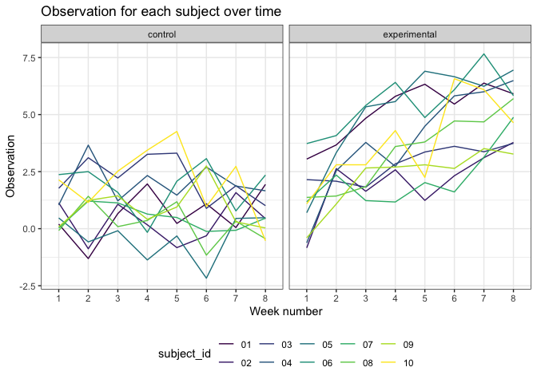

Homework 5
================
Nikhita Damaraju

This is my solution to Homework 5.

Library imports

``` r
library(tidyverse)
library(dplyr)
library(stringr)
library(ggplot2)


theme_set(theme_bw() + theme(legend.position = "bottom"))
options(
  ggplot2.continuous.colour = "viridis",
  ggplot2.continuous.fill = "viridis"
)
scale_colour_discrete = scale_color_viridis_d
scale_fill_discrete = scale_fill_viridis_d
```

## Problem 1

``` r
homicide_df = 
  read_csv('./problem1_data/homicide-data.csv')
```

    ## 
    ## ── Column specification ────────────────────────────────────────────────────────
    ## cols(
    ##   uid = col_character(),
    ##   reported_date = col_double(),
    ##   victim_last = col_character(),
    ##   victim_first = col_character(),
    ##   victim_race = col_character(),
    ##   victim_age = col_character(),
    ##   victim_sex = col_character(),
    ##   city = col_character(),
    ##   state = col_character(),
    ##   lat = col_double(),
    ##   lon = col_double(),
    ##   disposition = col_character()
    ## )

## Problem 2

Making combined tidy dataset using all the files

``` r
logitudinal_df = 
  tibble(
    path = list.files("./problem2_data/"),
  ) %>%
  mutate(
    path = str_c("./problem2_data/", path),
    data = map(.x = path, ~ read_csv(.x)),
    arm = case_when(
      str_detect(path, 'con') ~ 'control',
      str_detect(path, 'exp') ~ 'experimental'
    ),
    subject_id = str_sub(path, start = -6L, end = -5L)
  ) %>%
  select(-path) %>%
  unnest(data) 
```

Spaghetti plot showing observations over time per group

``` r
logitudinal_df %>%
  pivot_longer(
    week_1:week_8,
    names_to = "week",
    names_prefix = "week_",
    values_to = "observation"
  ) %>%
  ggplot(aes(x = week, y = observation, group = subject_id, color = subject_id)) +
  geom_line() +
  facet_grid(. ~ arm) + 
  labs(
    title = "Observation for each subject over time",
    x = "Week number",
    y = "Observation"
  )
```

<!-- -->

The data from the longitudinal study contains 10 participants with
unique subject IDs that have observations from a control arm and
experimental arm over a span of 8 weeks. It can be observed that the
observation values for the experimental arm are higher that the control
arm. Thus, there is a visual difference between the two groups.

## Problem 3
