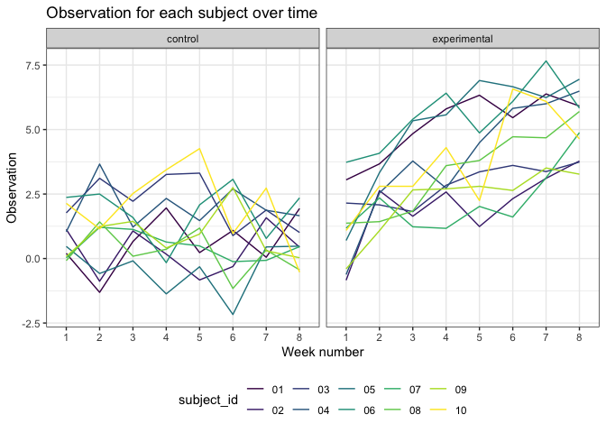
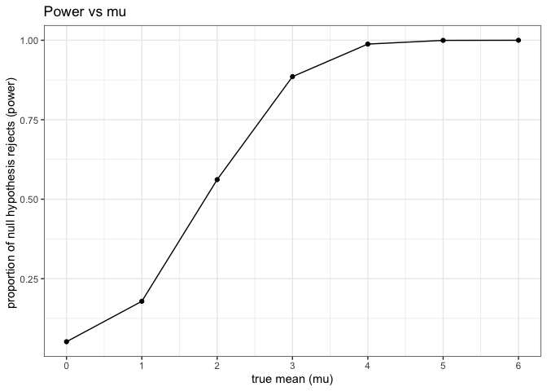
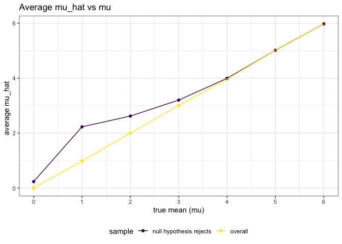

Homework 5
================
Nikhita Damaraju

This is my solution to Homework 5.

Library imports

``` r
library(tidyverse)
library(dplyr)
library(stringr)
library(ggplot2)


theme_set(theme_bw() + theme(legend.position = "bottom"))
options(
  ggplot2.continuous.colour = "viridis",
  ggplot2.continuous.fill = "viridis"
)
scale_colour_discrete = scale_color_viridis_d
scale_fill_discrete = scale_fill_viridis_d

# setting seed value
set.seed(1)
```

## Problem 1

Reading dataset and summarizing

``` r
homicide_df = 
  read_csv('./problem1_data/homicide-data.csv') %>%
  mutate(
    city_state = str_c(city, state, sep = "_"),
    resolved = case_when(
      disposition == 'Closed without arrest' ~ 'unsolved',
      disposition == 'Open/No arrest' ~ 'unsolved',
      disposition == 'Closed by arrest' ~ 'solved'
    )
  ) %>%
  select(city_state, resolved) %>%
  filter(city_state != 'Tulsa_AL')
```

#### Making aggregate dataframe for each city\_state

``` r
aggregate_df = 
  homicide_df %>%
  group_by(city_state) %>%
  summarize(
    total_homicides = n(),
    hom_unsolved = sum(resolved == 'unsolved')
  )
```

    ## `summarise()` ungrouping output (override with `.groups` argument)

``` r
aggregate_df %>% knitr::kable()
```

| city\_state        | total\_homicides | hom\_unsolved |
| :----------------- | ---------------: | ------------: |
| Albuquerque\_NM    |              378 |           146 |
| Atlanta\_GA        |              973 |           373 |
| Baltimore\_MD      |             2827 |          1825 |
| Baton Rouge\_LA    |              424 |           196 |
| Birmingham\_AL     |              800 |           347 |
| Boston\_MA         |              614 |           310 |
| Buffalo\_NY        |              521 |           319 |
| Charlotte\_NC      |              687 |           206 |
| Chicago\_IL        |             5535 |          4073 |
| Cincinnati\_OH     |              694 |           309 |
| Columbus\_OH       |             1084 |           575 |
| Dallas\_TX         |             1567 |           754 |
| Denver\_CO         |              312 |           169 |
| Detroit\_MI        |             2519 |          1482 |
| Durham\_NC         |              276 |           101 |
| Fort Worth\_TX     |              549 |           255 |
| Fresno\_CA         |              487 |           169 |
| Houston\_TX        |             2942 |          1493 |
| Indianapolis\_IN   |             1322 |           594 |
| Jacksonville\_FL   |             1168 |           597 |
| Kansas City\_MO    |             1190 |           486 |
| Las Vegas\_NV      |             1381 |           572 |
| Long Beach\_CA     |              378 |           156 |
| Los Angeles\_CA    |             2257 |          1106 |
| Louisville\_KY     |              576 |           261 |
| Memphis\_TN        |             1514 |           483 |
| Miami\_FL          |              744 |           450 |
| Milwaukee\_wI      |             1115 |           403 |
| Minneapolis\_MN    |              366 |           187 |
| Nashville\_TN      |              767 |           278 |
| New Orleans\_LA    |             1434 |           930 |
| New York\_NY       |              627 |           243 |
| Oakland\_CA        |              947 |           508 |
| Oklahoma City\_OK  |              672 |           326 |
| Omaha\_NE          |              409 |           169 |
| Philadelphia\_PA   |             3037 |          1360 |
| Phoenix\_AZ        |              914 |           504 |
| Pittsburgh\_PA     |              631 |           337 |
| Richmond\_VA       |              429 |           113 |
| Sacramento\_CA     |              376 |           139 |
| San Antonio\_TX    |              833 |           357 |
| San Bernardino\_CA |              275 |           170 |
| San Diego\_CA      |              461 |           175 |
| San Francisco\_CA  |              663 |           336 |
| Savannah\_GA       |              246 |           115 |
| St. Louis\_MO      |             1677 |           905 |
| Stockton\_CA       |              444 |           266 |
| Tampa\_FL          |              208 |            95 |
| Tulsa\_OK          |              583 |           193 |
| Washington\_DC     |             1345 |           589 |

The raw dataset consists of homicide data for 50 cities in the United
States. Columns of interest include disposition that is indicative of
the status of a crime - solved or unsolved. The above table summarizes
the total homicides and unsolved homicides by city

#### Prop.test for Baltimore

``` r
prop.test(
  aggregate_df %>% filter(city_state == 'Baltimore_MD') %>% pull(hom_unsolved),
  aggregate_df %>% filter(city_state == 'Baltimore_MD') %>% pull(total_homicides)
) %>%
  broom::tidy() %>%
  knitr::kable()
```

|  estimate | statistic | p.value | parameter |  conf.low | conf.high | method                                               | alternative |
| --------: | --------: | ------: | --------: | --------: | --------: | :--------------------------------------------------- | :---------- |
| 0.6455607 |   239.011 |       0 |         1 | 0.6275625 | 0.6631599 | 1-sample proportions test with continuity correction | two.sided   |

#### Prop.test for all cities using iteration

``` r
results_df =
  aggregate_df %>%
  mutate(
    prop_test_val = map2(.x = hom_unsolved, .y = total_homicides, ~prop.test(x = .x, n = .y)),
    tidy_test = map(.x = prop_test_val, ~broom::tidy(.x))
  ) %>%
  select(-c(prop_test_val)) %>%
  unnest(tidy_test) %>%
  select(city_state, estimate, conf.low, conf.high)
```

#### Plot showing estimate and CIs for each city

``` r
results_df %>%
  mutate(city_state = fct_reorder(city_state, estimate)) %>%
  ggplot(aes(x = city_state, y = estimate)) +
  geom_point() + 
  geom_errorbar(aes(ymin = conf.low, ymax = conf.high)) +
  theme(axis.text.x = element_text(angle = 90, vjust = 0.5, hjust = 1))
```

<!-- -->

It is observed that the homicide estimates are lowest in Richmond\_VA
and highest in Chicago\_IL.

## Problem 2

Making combined tidy dataset using all the files

``` r
logitudinal_df = 
  tibble(
    path = list.files("./problem2_data/"),
  ) %>%
  mutate(
    path = str_c("./problem2_data/", path),
    data = map(.x = path, ~ read_csv(.x)),
    arm = case_when(
      str_detect(path, 'con') ~ 'control',
      str_detect(path, 'exp') ~ 'experimental'
    ),
    subject_id = str_sub(path, start = -6L, end = -5L)
  ) %>%
  select(-path) %>%
  unnest(data) 
```

#### Spaghetti plot showing observations over time per group

``` r
logitudinal_df %>%
  pivot_longer(
    week_1:week_8,
    names_to = "week",
    names_prefix = "week_",
    values_to = "observation"
  ) %>%
  ggplot(aes(x = week, y = observation, group = subject_id, color = subject_id)) +
  geom_line() +
  facet_grid(. ~ arm) + 
  labs(
    title = "Observation for each subject over time",
    x = "Week number",
    y = "Observation"
  )
```

<!-- -->

The data from the longitudinal study contains 10 participants with
unique subject IDs that have observations from a control arm and
experimental arm over a span of 8 weeks. It can be observed that the
observation values for the experimental arm are higher that the control
arm. Thus, there is a visual difference between the two groups.

## Problem 3

Function to calculate all required variables for each dataset

``` r
sim_hypothesis = function(n, mu, sigma = 5) {
  
  sim_data = tibble(
    samp = rnorm(n, mean = mu, sd = sigma),
  )
  
  sim_data %>%
    summarize(
      mu = mu,
      t.test(samp, mu = 0, alternative = 'two.sided', paired = FALSE, conf.level = 0.95) %>% broom::tidy() %>% select(p.value, estimate)
   ) 
  
}
```

Running function for different values of mu for 5000 iterations

``` r
output = vector("list", 7)

for (i in 1:7) {
  output[[i]] = rerun(5000, sim_hypothesis(30, (i - 1))) %>%
    bind_rows()
}

sim_results = bind_rows(output) 
```

#### Proportion of times null was rejected

``` r
sim_results =
  sim_results %>%
  mutate(
    test_result = case_when(
      p.value < .05 ~ "reject",
      p.value >= .05 ~ "fail to reject"
    ))

sim_results %>%
  filter(test_result == 'reject') %>%
  group_by(mu) %>%
  summarize(
    proportion = n()/5000
  ) %>%
  ggplot(aes(x = mu, y = proportion)) +
  geom_point() +
  geom_line() +
  labs(
    title = "Power vs mu",
    x = "true mean (mu)",
    y = "proportion of null hypothesis rejects (power) "
  ) +
  scale_x_continuous(
    breaks = (0:6)
  )
```

    ## `summarise()` ungrouping output (override with `.groups` argument)

<!-- -->

It can be observed that the power increases with an increase in effect
size using a constant significance level of 0.05.

#### Average estimate of mu\_hat

``` r
average_df = 
  sim_results %>%
  group_by(mu) %>%
  summarize(
    average_estimate = mean(estimate)
  ) %>%
  mutate(
    sample = 'overall'
  )
```

    ## `summarise()` ungrouping output (override with `.groups` argument)

``` r
average_rejects = 
  sim_results %>%
  filter(test_result == 'reject') %>%
  group_by(mu) %>%
  summarize(
    average_estimate = mean(estimate)
  ) %>%
  mutate(
    sample = 'null hypothesis rejects'
  )
```

    ## `summarise()` ungrouping output (override with `.groups` argument)

``` r
# plotting both plots together 

rbind(average_df, average_rejects) %>%
ggplot(aes(x = mu, y = average_estimate, group = sample, color = sample)) +
geom_point() +
geom_line() +
labs(
  title = "Average mu_hat vs mu",
  x = "true mean (mu)",
  y = "average mu_hat  "
) +
scale_x_continuous(
  breaks = (0:6)
)
```

<!-- -->

The sample average of mu\_hat for the null rejects is *not*
approximately equal to the true value of mu. This is because the
probability of rejecting the null hypothesis is the lowest when the
estimated mean is closer to 0.
