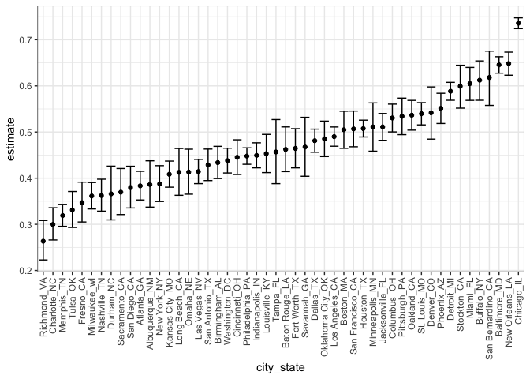

Homework 5
================
Nikhita Damaraju

This is my solution to Homework 5.

Library imports

``` r
library(tidyverse)
library(dplyr)
library(stringr)
library(ggplot2)


theme_set(theme_bw() + theme(legend.position = "bottom"))
options(
  ggplot2.continuous.colour = "viridis",
  ggplot2.continuous.fill = "viridis"
)
scale_colour_discrete = scale_color_viridis_d
scale_fill_discrete = scale_fill_viridis_d
```

## Problem 1

Reading dataset and filtering

``` r
homicide_df = 
  read_csv('./problem1_data/homicide-data.csv') %>%
  mutate(
    city_state = str_c(city, state, sep = "_"),
    resolved = case_when(
      disposition == 'Closed without arrest' ~ 'unsolved',
      disposition == 'Open/No arrest' ~ 'unsolved',
      disposition == 'Closed by arrest' ~ 'solved'
    )
  ) %>%
  select(city_state, resolved) %>%
  filter(city_state != 'Tulsa_AL')
```

Making aggregate dataframe for each city\_state

``` r
aggregate_df = 
  homicide_df %>%
  group_by(city_state) %>%
  summarize(
    total_homicides = n(),
    hom_unsolved = sum(resolved == 'unsolved')
  )
```

    ## `summarise()` ungrouping output (override with `.groups` argument)

#### Prop.test for Baltimore

``` r
prop.test(
  aggregate_df %>% filter(city_state == 'Baltimore_MD') %>% pull(hom_unsolved),
  aggregate_df %>% filter(city_state == 'Baltimore_MD') %>% pull(total_homicides)
) %>%
  broom::tidy() %>%
  knitr::kable()
```

|  estimate | statistic | p.value | parameter |  conf.low | conf.high | method                                               | alternative |
| --------: | --------: | ------: | --------: | --------: | --------: | :--------------------------------------------------- | :---------- |
| 0.6455607 |   239.011 |       0 |         1 | 0.6275625 | 0.6631599 | 1-sample proportions test with continuity correction | two.sided   |

#### Prop.test for all cities using iteration

``` r
results_df =
  aggregate_df %>%
  mutate(
    prop_test_val = map2(.x = hom_unsolved, .y = total_homicides, ~prop.test(x = .x, n = .y)),
    tidy_test = map(.x = prop_test_val, ~broom::tidy(.x))
  ) %>%
  select(-c(prop_test_val)) %>%
  unnest(tidy_test) %>%
  select(city_state, estimate, conf.low, conf.high)
```

#### Plot showing estimate and CIs for each city

``` r
results_df %>%
  mutate(city_state = fct_reorder(city_state, estimate)) %>%
  ggplot(aes(x = city_state, y = estimate)) +
  geom_point() + 
  geom_errorbar(aes(ymin = conf.low, ymax = conf.high)) +
  theme(axis.text.x = element_text(angle = 90, vjust = 0.5, hjust = 1))
```

<!-- -->

It is observed that the homicide estimates are lowest in Richmond\_VA
and highest in Chicago\_IL.

## Problem 2

Making combined tidy dataset using all the files

``` r
logitudinal_df = 
  tibble(
    path = list.files("./problem2_data/"),
  ) %>%
  mutate(
    path = str_c("./problem2_data/", path),
    data = map(.x = path, ~ read_csv(.x)),
    arm = case_when(
      str_detect(path, 'con') ~ 'control',
      str_detect(path, 'exp') ~ 'experimental'
    ),
    subject_id = str_sub(path, start = -6L, end = -5L)
  ) %>%
  select(-path) %>%
  unnest(data) 
```

#### Spaghetti plot showing observations over time per group

``` r
logitudinal_df %>%
  pivot_longer(
    week_1:week_8,
    names_to = "week",
    names_prefix = "week_",
    values_to = "observation"
  ) %>%
  ggplot(aes(x = week, y = observation, group = subject_id, color = subject_id)) +
  geom_line() +
  facet_grid(. ~ arm) + 
  labs(
    title = "Observation for each subject over time",
    x = "Week number",
    y = "Observation"
  )
```

<!-- -->

The data from the longitudinal study contains 10 participants with
unique subject IDs that have observations from a control arm and
experimental arm over a span of 8 weeks. It can be observed that the
observation values for the experimental arm are higher that the control
arm. Thus, there is a visual difference between the two groups.
